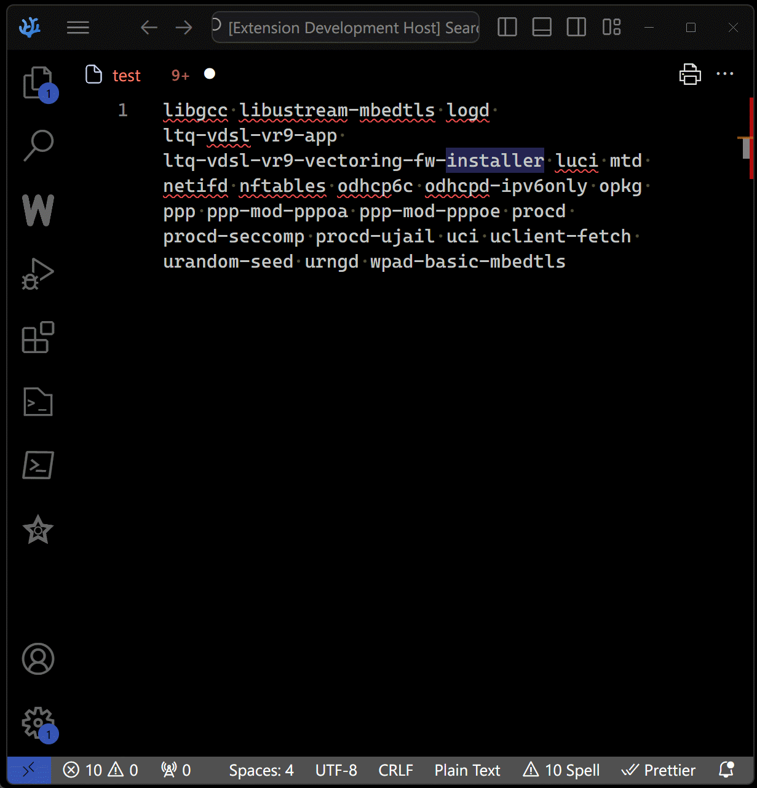

# OpenWRT Package Info for VSCodium

## Introduction
OpenWRT Package Info is a VSCodium extension designed to enhance the workflow of developers by providing easy access to detailed descriptions of OpenWRT packages directly in the editor.

## Features
- **Easy Access to Information**: Obtain detailed descriptions of OpenWRT packages without leaving VSCodium.
- **Streamlined Workflow**: Enhance your development efficiency with quick access to package information.

## Demo

## Installation
Find and install "OpenWRT Package Info" from the VSCodium extensions marketplace.

## Usage
To use the extension, open the Command Palette (`Ctrl+Shift+P`) and select "Show OpenWRT Package Info". The extension will display information for the package name under the cursor.

## Contributing
Contributions are welcome. Please report issues or suggest enhancements through GitHub pull requests or issues.

## Release Notes

### 0.0.1
- Initial release with functionality to display OpenWRT package descriptions within VSCodium.

## License
Licensed under the MIT License - see the [LICENSE](LICENSE) file for details.

## Support
Encounter an issue or have a suggestion? Please open an issue on the [GitHub repository](https://github.com/amathron-com/a-vscodium-openwrt-package-info.git).

## Acknowledgments
A special thanks to the OpenWRT community and all the contributors who support and improve this extension.